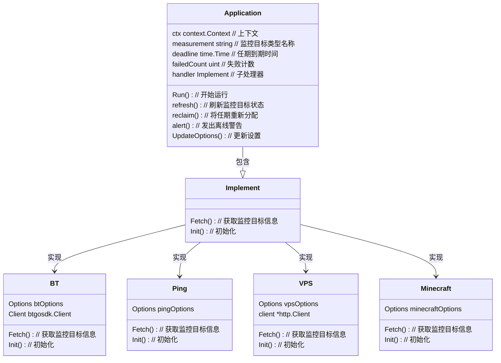

# bellis （正在开发）

分布式云监控告警系统，采用各模块分工明确的设计，模块间通过 GRPC、消息队列（Redis）通信，采样数据通过 InfluxDB 存储。

| 主页面                                                                                                    | 添加监控目标                                                                                                 |
|--------------------------------------------------------------------------------------------------------|--------------------------------------------------------------------------------------------------------|
|  |  |

### 架构设计

### 模板模式

